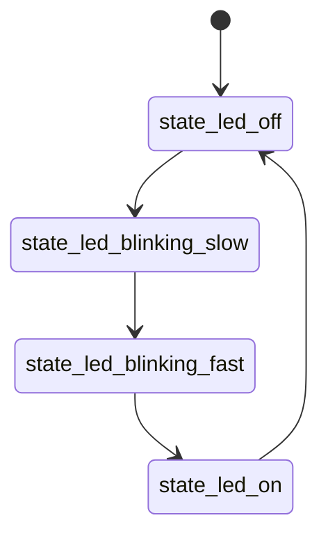

### State Machine Library (SML) Hello World on STM32

This is example STM32 C++ project using a boost::sml state machine library.

Boost SML is simple and fast state machine library which can be used in STM32 projects (needs at least c++14).
SML is header only library, so you need download end extract library, update include patchs with it and add one include in your cpp code:  
`#include <boost/sml.hpp>`  

More info [https://boost-ext.github.io/sml/tutorial.html](https://boost-ext.github.io/sml/tutorial.html)

Program changes a light of onboard LED accordingly to the current state.
Project was prepared for the blackpill dev board with STM32F401CCU.

#### State machine definition

State machine is simple



definition in cpp:

```cpp
class BlinkingLED {
public:
   auto operator()(){
     return make_transition_table(
       *"state_led_off"_s + event<timer_event> = "state_led_blinking_slow"_s
      , "state_led_blinking_slow"_s + event<timer_event> = "state_led_blinking_fast"_s
      , "state_led_blinking_fast"_s + event<timer_event> / action_led_on = "state_led_on"_s
      , "state_led_on"_s + event<timer_event> / action_led_off = "state_led_off"_s
   );
   }
};

sm<BlinkingLED> state_machine;
```

Event and actions definitions:
```cpp

struct timer_event {};

auto action_led_on = [] {
   HAL_GPIO_WritePin(GPIO_LED_GPIO_Port, GPIO_LED_Pin, GPIO_PIN_RESET);
};
auto action_led_off = [] {
   HAL_GPIO_WritePin(GPIO_LED_GPIO_Port, GPIO_LED_Pin, GPIO_PIN_SET);
};
```
